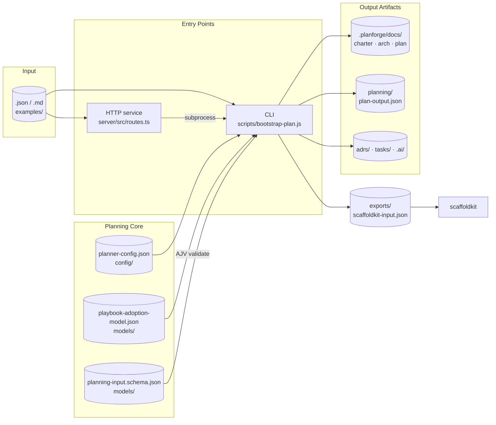

# agent-planforge

Planning bootstrap for AI agents that need to turn rough requirements into a first architecture, initial ADR candidates, and an implementation backlog.

Status: Production-ready. All planned hardening tasks complete. Open enhancements tracked as GitHub Issues.

`agent-planforge` is open source under the MIT license. Contribution, security reporting, and community expectations are documented in this repository.

## How it works

A planning-input document enters through the CLI or HTTP service, both of which drive the same planning core (config, playbook, schema validation) and write a structured set of artifact directories plus a scaffoldkit handoff.



## Used In Production

**[project-forge](https://github.com/LanNguyenSi/project-forge)** uses `agent-planforge` as its planning backbone. When a user describes a project, project-forge calls the planforge API, runs the full planning pipeline, and surfaces the results — architecture overview, task backlog, delivery plan, and scaffold status — in an interactive preview before any code is generated.

### The Trio

`agent-planforge` works best as part of a three-tool chain:

| Tool | Role |
|------|------|
| **agent-planforge** | Planning — turns rough requirements into architecture, tasks, and delivery plan |
| **[scaffoldkit](https://github.com/LanNguyenSi/scaffoldkit)** | Scaffolding — generates the initial repository structure from the planforge output |
| **[agent-engineering-playbook](https://github.com/LanNguyenSi/agent-engineering-playbook)** | Execution — provides the coding agent with workflow, testing, and governance playbooks |

planforge produces an `exports/scaffoldkit-input.json` that wires directly into scaffoldkit. The generated root `AGENTS.md` points agents into `.ai/` and the grouped planning outputs so the downstream coding agent has a clean starting point from day one.

## What This Project Does

`agent-planforge` is a lightweight planning layer for the earliest engineering phase of a project.

Given rough input such as:

- product goal
- target users
- core features
- constraints
- data sensitivity
- integrations
- timeline
- planning profile

it produces a first planning package:

- intake completeness and targeted follow-up questions
- project charter
- architecture overview with scored options
- initial ADR candidate
- task backlog with dependencies
- delivery plan with execution waves
- rerun and resume metadata
- machine-readable planning output
- phase rationale and recommended artifacts
- explicit guidance areas beyond the local planning playbook
- downstream exports for ScaffoldKit and `.ai/`

The point is not perfect planning. The point is a repeatable and reviewable starting point.

## Current Scope

This first version includes:

- a planning playbook
- an external planner ruleset in `config/planner-config.json`
- partial config override merge semantics
- JSON schemas for planning input and output
- a Node CLI that bootstraps planning artifacts from JSON, text, or markdown input
- gap detection for missing planning context
- reusable markdown templates for generated planning artifacts
- profile-aware planning modes for startup, product, enterprise, and platform work
- schema validation for input, config, and generated output
- `.ai/` context export for downstream coding agents
- playbook-aware charter and prompt references
- rerun/resume reporting and integration exports

## Open Source Project Status

This repository is public-facing and contribution-ready, but still early.

- Core planning flow: usable
- Schema validation: implemented
- Test coverage: automated
- `.ai/` context generation: implemented
- Playbook integration: implemented
- Remaining enhancements tracked in `tasks/`
- API and output compatibility: not yet guaranteed across minor revisions

## Quick Start

Requirements:

- Node.js 18+

Run:

```bash
node scripts/bootstrap-plan.js \
  --input examples/sample-input.json \
  --outdir out/sample
```

Markdown input:

```bash
node scripts/bootstrap-plan.js \
  --input examples/sample-input.md \
  --format markdown \
  --outdir out/sample-md
```

Optional override:

```bash
node scripts/bootstrap-plan.js \
  --input examples/sample-input.json \
  --outdir out/sample-custom \
  --config examples/planner-config.override.json
```

Validation-only mode:

```bash
node scripts/bootstrap-plan.js \
  --input examples/sample-input.json \
  --validate-only
```

Clarification pass before planning:

```bash
node scripts/bootstrap-plan.js \
  --input examples/minimal-input.json \
  --clarify
```

Auto-accept default clarifications and continue:

```bash
node scripts/bootstrap-plan.js \
  --input examples/minimal-input.json \
  --outdir out/sample-clarified \
  --auto-clarify
```

Concise summary mode:

```bash
node scripts/bootstrap-plan.js \
  --input examples/sample-input.json \
  --outdir out/sample \
  --summary
```

Rerun with change tracking:

```bash
node scripts/bootstrap-plan.js \
  --input examples/sample-input.json \
  --outdir out/sample-rerun \
  --rerun-from out/sample
```

Resume while preserving manual run state:

```bash
node scripts/bootstrap-plan.js \
  --input examples/sample-input.json \
  --outdir out/sample-resume \
  --resume-from out/sample
```

Consistency analysis after generation:

```bash
node scripts/analyze-artifacts.js --outdir out/sample
```

Skip npm install (useful for CI or when package.json not generated):

```bash
node scripts/bootstrap-plan.js \
  --input examples/sample-input.json \
  --outdir out/sample \
  --no-install
```

**Note:** By default, if a `package.json` file exists in the output directory after generation, `bootstrap-plan` will run `npm install` there. If that install fails, the command now exits non-zero. Use `--no-install` when you only want planning artifacts.

This creates:

- `out/sample/AGENTS.md`
- `out/sample/CLAUDE.md`
- `out/sample/planforge-index.json`
- `out/sample/planning/plan-output.json`
- `out/sample/planning/structured-input.json`
- `out/sample/PROJECT.md`
- `out/sample/.planforge/docs/intake-questionnaire.md`
- `out/sample/.planforge/docs/project-charter.md`
- `out/sample/.planforge/docs/architecture-overview.md`
- `out/sample/.planforge/docs/delivery-plan.md`
- `out/sample/planning/rerun-report.json`
- `out/sample/planning/rerun-summary.md`
- `out/sample/exports/scaffoldkit-input.json`
- `out/sample/.ai/`
- `out/sample/specs/clarifications.md` when `--clarify` or `--auto-clarify` is used
- `out/sample/adrs/`
- `out/sample/tasks/`
- `out/sample/outputs/consistency-report.md` when `analyze-artifacts.js` is run
- `out/sample/governance/` for enterprise-path starter docs when relevant
- `out/sample/runbooks/` for production-oriented starter runbooks when relevant

`out/` is intentionally gitignored. To refresh the local example outputs so they match the current generator behavior, run:

```bash
npm run plan:refresh-examples
```

If you are updating scripts or agents from the older flat root layout, see [docs/output-layout-migration.md](docs/output-layout-migration.md).

## Repository Structure

- `.github/`
- `CODE_OF_CONDUCT.md`
- `CONTRIBUTING.md`
- `LICENSE`
- `SECURITY.md`
- `config/planner-config.json`
- `docs/operational-workflow.md`
- `examples/sample-input.json`
- `examples/sample-input.md`
- `models/planning-input.schema.json`
- `models/planning-output.schema.json`
- `models/planner-config.schema.json`
- `playbooks/planning-and-scoping.md`
- `scripts/bootstrap-plan.js`
- `server/` (HTTP service sub-package)
- `templates/`
- `tasks/`

## Design Principles

- small, reviewable outputs beat ambitious but opaque planning
- default to the smallest architecture that satisfies current risk
- expose open questions and risks instead of pretending certainty
- keep generated artifacts editable by humans and agents
- ask for missing information explicitly when confidence would otherwise be fake

## Planning Model

`agent-planforge` follows the same delivery model as the broader playbook:

- spec-driven planning: make the intended outcome, scope, constraints, acceptance criteria, and risks explicit before implementation starts
- context-driven execution: provide enough architecture, domain, security, and operational context for downstream agents and humans to make sound decisions
- eval-driven delivery: carry forward the evidence needed to ship safely through tests, review, rollout readiness, and operational verification

## Config Override Merge Semantics

Planner config overrides are merged onto the base config instead of replacing it wholesale.

Rules:

- top-level scalars like `defaultProfile` replace the base value when provided
- guidance and artifact arrays are merged as ordered unions
- per-phase guidance and artifact maps merge by phase key, then union their arrays
- profile `intakePolicy` merges by key
- `governanceDefaults` merges by key

Example:

`examples/planner-config.override.json` overrides only a few fields. Running with `--config` keeps the base config and adds:

- `founder feedback loop` to `startup.phase_1` guidance
- `third-party risk review` to `common.guidanceAreasByPhase.phase_3`
- a custom `breakGlassCadence`

## Operational Workflow

The end-to-end operating model for planning, review, and replanning is documented in [docs/operational-workflow.md](docs/operational-workflow.md).

## Contributing

Contribution guidelines live in [CONTRIBUTING.md](CONTRIBUTING.md).

For now, the most useful contributions are:

- replanning semantics
- downstream integration polish

## Security

Security reporting guidance lives in [SECURITY.md](SECURITY.md). Do not open a public issue for a suspected vulnerability affecting confidentiality, integrity, or access control.

## Code Of Conduct

Community expectations live in [CODE_OF_CONDUCT.md](CODE_OF_CONDUCT.md).

## License

This project is licensed under the MIT license. See [LICENSE](LICENSE).

## Next Steps

The initial hardening backlog is complete. Add new task files in `tasks/` when follow-on work needs to be tracked.

## Testing

Run the automated suite with:

```bash
npm test
```

The tests cover:

- golden-path planning for `sample`, `minimal`, `platform`, and markdown inputs
- schema validation failures for bad input and bad config
- config merge behavior
- rerun and resume metadata
- dependency graph and rerun/resume reporting
- playbook references and `.ai/` artifact generation

## HTTP Service

A thin Hono + TypeScript HTTP surface around the planner lives in
[`server/`](server/README.md). It lets project-forge (and agents) drive the
planner over the network instead of shelling out to the CLI on the same
machine:

- `POST /api/generate` — run the planner (Bearer `PLANFORGE_SERVICE_TOKEN`), streaming progress as SSE
- `GET /healthz` — unauthenticated liveness probe (Traefik / ops dashboard target)

It listens on port `8223` by default. See [`server/README.md`](server/README.md)
for the full endpoint, environment, and deployment reference.

## Docker

The container image packages the HTTP service (see [HTTP Service](#http-service)).
The only Dockerfile is `server/Dockerfile`, so build it explicitly:

```bash
docker build -f server/Dockerfile -t agent-planforge .
docker run -p 8223:8223 -e PLANFORGE_SERVICE_TOKEN=<token> agent-planforge
```
