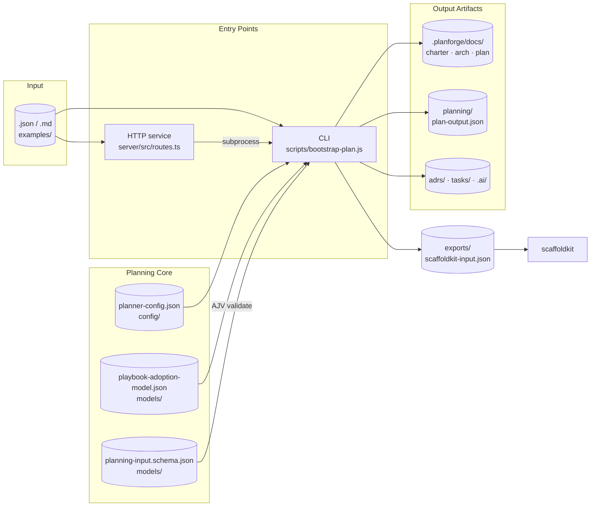

# Architecture

## How It Works

A planning-input document enters through the CLI or the HTTP service, both of which drive the same planning core (config, playbook, schema validation) and write a structured set of artifact directories plus a scaffoldkit handoff.

## Inputs And Outputs

Given rough input such as:

- product goal
- target users
- core features
- constraints
- data sensitivity
- integrations
- timeline
- planning profile

planforge produces a first planning package that also includes:

- intake completeness and targeted follow-up questions
- phase rationale and recommended artifacts
- explicit guidance areas beyond the local planning playbook

## Design Principles

- small, reviewable outputs beat ambitious but opaque planning
- default to the smallest architecture that satisfies current risk
- expose open questions and risks instead of pretending certainty
- keep generated artifacts editable by humans and agents
- ask for missing information explicitly when confidence would otherwise be fake

## Planning Model

`agent-planforge` follows the same delivery model as the broader playbook:

- spec-driven planning: make the intended outcome, scope, constraints, acceptance criteria, and risks explicit before implementation starts
- context-driven execution: provide enough architecture, domain, security, and operational context for downstream agents and humans to make sound decisions
- eval-driven delivery: carry forward the evidence needed to ship safely through tests, review, rollout readiness, and operational verification

## Current Scope

This version includes:

- a planning playbook
- an external planner ruleset in `config/planner-config.json`
- partial config override merge semantics (see [docs/configuration.md](configuration.md))
- JSON schemas for planning input and output
- a Node CLI that bootstraps planning artifacts from JSON, text, or markdown input
- gap detection for missing planning context
- reusable markdown templates for generated planning artifacts
- profile-aware planning modes for startup, product, enterprise, and platform work
- schema validation for input, config, and generated output
- `.ai/` context export for downstream coding agents
- playbook-aware charter and prompt references
- rerun/resume reporting and integration exports

## Related Tools

`agent-planforge` works best as part of a three-tool chain:

| Tool | Role |
|------|------|
| **agent-planforge** | Planning: turns rough requirements into architecture, tasks, and delivery plan |
| **[scaffoldkit](https://github.com/LanNguyenSi/scaffoldkit)** | Scaffolding: generates the initial repository structure from the planforge output |
| **[agent-engineering-playbook](https://github.com/LanNguyenSi/agent-engineering-playbook)** | Execution: provides the coding agent with workflow, testing, and governance playbooks |

planforge produces an `exports/scaffoldkit-input.json` that wires directly into scaffoldkit. The generated root `AGENTS.md` points agents into `.ai/` and the grouped planning outputs so the downstream coding agent has a clean starting point from day one.

See [docs/scaffoldkit-planforge-workflow.md](scaffoldkit-planforge-workflow.md) for the detailed division of responsibility between scaffoldkit and planforge.

## Repository Structure

- `.github/`
- `CODE_OF_CONDUCT.md`
- `CONTRIBUTING.md`
- `LICENSE`
- `SECURITY.md`
- `config/planner-config.json`
- `docs/`
- `examples/sample-input.json`
- `examples/sample-input.md`
- `models/planning-input.schema.json`
- `models/planning-output.schema.json`
- `models/planner-config.schema.json`
- `playbooks/planning-and-scoping.md`
- `scripts/bootstrap-plan.js`
- `server/` (HTTP service sub-package)
- `templates/`
- `tasks/`

## Testing

Run the automated suite with `npm test` (see [CONTRIBUTING.md](../CONTRIBUTING.md) for the full development workflow). The suite covers:

- golden-path planning for `sample`, `minimal`, `platform`, and markdown inputs
- schema validation failures for bad input and bad config
- config merge behavior
- rerun and resume metadata
- dependency graph and rerun/resume reporting
- playbook references and `.ai/` artifact generation
